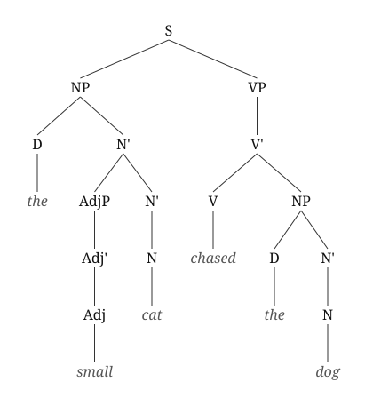
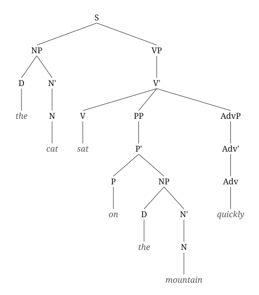
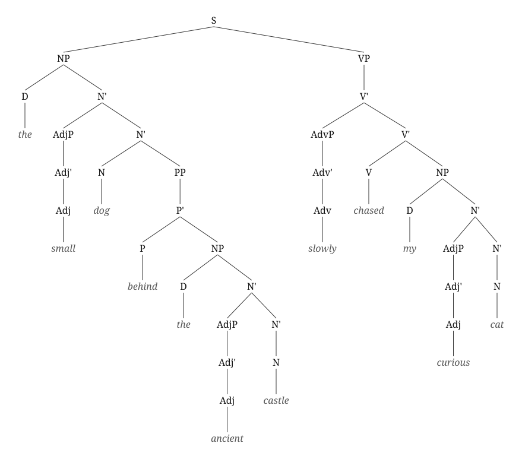

# X-Bar Syntax Tree Builder
This project is a simple syntax tree builder for English sentences, executed in Python. It uses a small lexicon and a hand-written grammar inspired by X-bar theory to parse basic sentence structures and display their syntax trees.

The goal of the project is to demonstrate basic syntatic trees to beginners, showing how syntax trees are built with X-bar theory.

# Examples
**"the small cat chased the dog"** — a transitive verb with its NP complement; the adjective left-adjoins to N':

**"every clever child arrived on the mountain"** — an intransitive verb with a post-verbal PP right-adjoined to V':

**"the small dog behind the ancient castle slowly chased my curious cat"** — a pre-verbal adverb left-adjoined to V'; the PP nests inside the subject NP:

# Features
- Only right side supported recursion 
- Simple English grammar (NP, VP, PP, AdvP, AdjP, Det)
- Post-verbal modifiers: PPs and adverbs after the verb (e.g. "my curious cat slept beside the river quietly")
- Text-based syntax tree rendering
- SVG tree diagram output (saved as tree.svg, no extra dependencies)
- X-bar theory embedded to the grammar

# How to Run
From the project root directory:
python main.py

# Motivation
This project was created as a learning exercise to combine Python programming with  basic linguistic theory, particularly syntax and phrase structure.